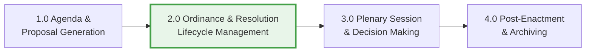
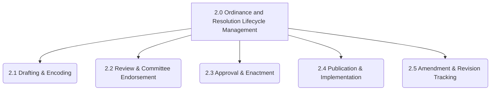
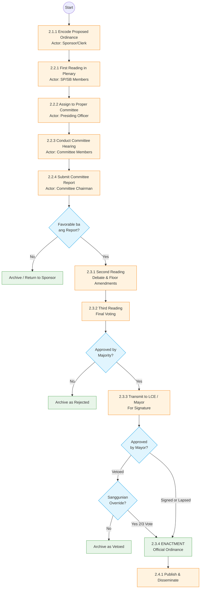

# Business Process Architecture (BPA)
**Domain:** Local Government Unit (LGU) Legislative Process
**Focus:** Ordinance and Resolution Lifecycle Management System

Ang Business Process Architecture (BPA) na ito ay naka-base sa standard na proseso ng paggawa ng batas (Legislative Process) sa Pilipinas alinsunod sa **Local Government Code of 1991 (R.A. 7160)**. Hinihimay nito ang proseso mula sa pinakamalawak (Level 1) hanggang sa pinaka-detalyado (Level 3).

---

## LEVEL 1: Process Area / Core Value Chain (Macro-Level)
Ito ang "Big Picture" ng buong Sangguniang Bayan/Panlungsod. Ipinapakita nito ang end-to-end lifecycle ng isang batas mula sa pagiging idea hanggang sa pagiging opisyal na batas.

* **1.0 Agenda & Proposal Generation:** Pagpasok ng mga suhestiyon galing sa Executive, Citizens, o Research.
* **2.0 Ordinance & Resolution Lifecycle:** (Ito ang System Ninyo) Ang mismong pag-draft, pag-review, at pag-manage ng dokumento bago at pagkatapos botohan.
* **3.0 Plenary Session:** Ang pagdinig at botohan sa loob ng session hall.
* **4.0 Post-Enactment:** Pag-publish, pag-monitor, at pag-archive ng batas.

---

## LEVEL 2: Process Groups (Decomposition of Level 1)
Dito natin hihimayin ang **2.0 Ordinance & Resolution Lifecycle Management** (yung system ninyo mismo). Hahatiin natin ito sa mga logical process groups (yung mga Modules ninyo).

* **2.1 Drafting & Encoding:** Paggawa ng pormal na draft mula sa proposal. Kasama ang paglagay ng title, author, at format.
* **2.2 Review & Committee Endorsement:** Pag-pasa sa kaukulang committee para pag-aralan (First Reading) at paggawa ng Committee Report.
* **2.3 Approval & Enactment:** Ang pag-track ng approval mula Second Reading hanggang pirma ng Mayor.
* **2.4 Publication:** Pag-release at pag-disseminate ng naipasang batas sa publiko.
* **2.5 Amendment Tracking:** Kapag may gustong baguhin sa luma at naipasa nang ordinansa.

---

## LEVEL 3: Detailed Process Flow (Task / Workflow Level)
Ito ang pinaka-detalyadong level. Ipinapakita nito ang step-by-step workflow ng isang ordinansa (Standard LGU Flow) at ang mga desisyon na kailangang gawin. Ito ang magiging basis ng logic ng system ninyo.

### Detalyadong Paliwanag sa Level 3 (Bakit ito ang Standard):
1. **Drafting (2.1.1):** I-encode sa system ang proposed ordinance.
2. **First Reading (2.2.1):** Babasahin lang ang title sa session. Pagkatapos, ipapasa sa system papunta sa tamang Committee.
3. **Committee Level (2.2.3 - 2.2.4):** Gagawa ng hearing ang committee. Dito i-u-upload sa system ang **Committee Report**. Kung hindi pumasa sa committee, tigil na ang proseso (Archive).
4. **Second & Third Reading (2.3.1 - 2.3.2):** Kung pumasa sa committee, ibabalik sa session. Pwede magkaroon ng floor amendments (dito papasok yung *Amendment Tracking* ninyo during session). Tapos, final voting.
5. **Enactment (2.3.3 - 2.3.4):** Kapag nanalo sa boto, ipapadala sa Mayor (Local Chief Executive). Kapag pinirmahan (o hindi pinansin ng ilang araw kaya nag-lapse into law), magiging **ENACTED** na. Kung na-Veto (ni-reject ng Mayor), pwedeng i-override ng konseho basta 2/3 ang boboto.
6. **Publication (2.4.1):** Ang last step sa system ay ang pag-generate ng final document at pag-publish nito.
